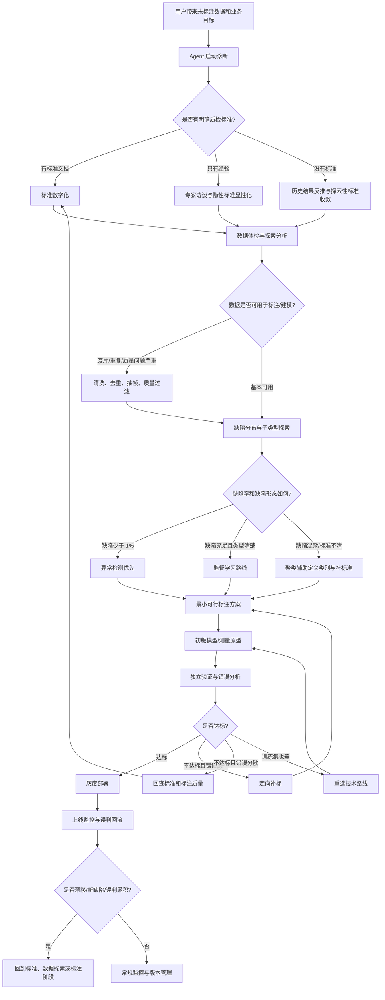
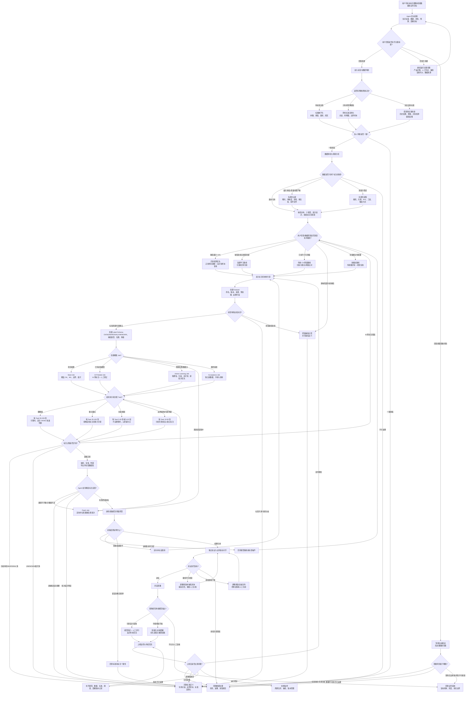

# 工业质检 Agent 全流程分支决策报告（未标注数据场景）

> 适用对象：只有业务经验、拿着未标注工业图像/视频数据集，希望逐步构建自动质检能力的用户。  
> 适用场景：产线图像、视频、焊缝、表面缺陷、装配缺陷、尺寸测量、外观异常、低频缺陷、标准不清或标注体系尚未建立的真实工业项目。  
> 报告定位：这不是一份普通的算法路线说明，而是一套面向 Agent 的可执行分支决策手册。它回答的核心问题是：Agent 在每个阶段拿到不同答案后，应该继续问用户、理解数据、查资料、做实验、设计标注，还是回退修正标准。

---

## 1. 核心结论

工业质检项目在未标注数据场景下，真正的起点不是训练模型，也不是立刻标注，而是建立一套能被人、Agent、算法共同执行的判定标准。

对于 Agent 来说，正确的工作方式不是机械地推进“数据清洗、标注、训练、测试、上线”，而是持续判断当前最缺的是什么：

- 缺业务信息，就继续咨询用户。
- 缺判定依据，就整理标准或查找行业资料。
- 缺数据理解，就先做探索性分析。
- 缺标签，就设计最小可行标注闭环。
- 缺技术证据，就做小实验验证路线。
- 出现错误信号，就判断应该回退到标准、标注、数据探索，还是模型选型。

因此，本报告把工业质检流程改写为“Agent 决策树”。每个阶段不仅描述现实分支，还明确 Agent 应该采取的动作、应追问的问题、应产出的中间物、应触发的回退条件。

---

## 2. Agent 的基本工作原则

### 2.1 不把用户的问题直接翻译成模型任务

业务用户常见表达包括：

- “帮我识别不良品。”
- “判断焊缝合不合格。”
- “看看有没有缺陷。”
- “我们想做自动质检。”
- “这些图像还没标，你看能不能训练。”

Agent 不能立刻回答“用 YOLO”“用分类模型”“用异常检测”。因为这些表达还没有定义清楚：

- 合格与不合格的边界是什么？
- 缺陷是否可测量？
- 是否存在灰区？
- 漏检和误检代价是否相同？
- 数据中是否真的包含缺陷？
- 是否有历史判定结果可作为弱标签？
- 产线部署是否要求实时？

Agent 的第一职责是把模糊业务需求拆成可执行问题。

### 2.2 先建立判定标准，再建立标注标准，再建立模型标准

三类标准不能混在一起：

| 标准类型 | 说明 | 谁负责主导 |
|---|---|---|
| 业务判定标准 | 什么样的产品算合格、返修、报废、让步接收 | 质检负责人/工艺专家 |
| 标注执行标准 | 标注员看到某种图像时应该标什么类别、框哪里、画哪里 | Agent + 专家 + 标注负责人 |
| 模型验收标准 | 模型的漏检率、误检率、召回率、节拍、稳定性是否达标 | 业务负责人 + 算法负责人 |

如果业务判定标准不清，标注标准会漂移；标注标准漂移，模型即使训练成功，也只是在学习噪声。

### 2.3 Agent 要在四种动作之间切换

Agent 的每一步动作都应该归入以下四类之一：

| 动作 | 使用时机 | 示例 |
|---|---|---|
| 咨询用户 | 业务背景、风险、标准、资源不清时 | 追问“漏检代价是否高于误检？” |
| 理解数据 | 数据质量、分布、缺陷比例、批次差异不清时 | 做清晰度、曝光、重复帧、聚类分析 |
| 外部查证 | 标准、行业缺陷定义、相似方案不清时 | 查国标、企标、论文、开源数据集、案例 |
| 决策推进 | 信息足够时 | 给出标注方案、模型路线、验证方案、上线方案 |

一个成熟 Agent 不应该一直问，也不应该一直查，更不应该一直做实验。它应该判断当前瓶颈在哪里。

---

## 3. 总体流程图



---

## 4. 阶段 A：项目启动诊断

### 4.1 阶段目标

Agent 在这一阶段不急着做算法设计，而是判断项目是否具备继续推进的基础条件。

这一阶段要回答：

- 用户到底想检测什么？
- 业务判定标准是否存在？
- 数据和判定结果之间是否有关联线索？
- 项目能接受多大误检、漏检、人工复核比例？
- 当前最应该做的是标准整理、数据探索、标注设计，还是案例查证？

### 4.2 Agent 必问问题

Agent 应先向用户确认以下问题：

| 问题 | 目的 |
|---|---|
| 产品或工件是什么？ | 判断行业背景、缺陷类型、可参考标准 |
| 当前人工质检怎么判？ | 找到现有判定逻辑 |
| 是否有国标、企标、客户验收规范、SOP？ | 判断能否直接做标准数字化 |
| 有没有历史报废、返修、客诉、抽检记录？ | 判断是否存在弱标签 |
| 数据来自图像、视频，还是还有传感器数据？ | 判断技术路线是否纯视觉 |
| 每张图或每段视频是否有批次、设备、时间、工位信息？ | 判断是否能做批次追踪和漂移分析 |
| 漏检和误检哪个代价更高？ | 决定模型阈值和验收指标 |
| 最终目标是替代人工还是辅助人工？ | 决定是否必须保留人工复核通道 |
| 是否有专家能参与少量标注/仲裁？ | 决定标注质量控制方式 |
| 项目预算和周期大概是什么级别？ | 决定全量标注、主动学习或小样本路线 |

### 4.3 分支决策

#### 分支 A1：用户有明确标准文档

Agent 应采取的动作：

1. 要求用户提供标准文档、检验规程、缺陷判定表或客户验收要求。
2. 抽取其中可机器化的字段。
3. 将文字标准转成参数、阈值、类别、示例图需求。
4. 标记无法直接机器化的描述，例如“明显”“严重”“连续性差”“外观不良”。

Agent 产出：

- 《质检标准数字化表》
- 《缺陷类别与判定边界草案》
- 《需要专家确认的问题清单》

#### 分支 A2：用户只有老师傅经验，没有成文标准

Agent 不应直接进入标注，而应组织隐性知识萃取。

Agent 应追问：

- 老师傅通常看哪些区域？
- 哪些缺陷一定报废？
- 哪些缺陷可以返修？
- 哪些情况会有争议？
- 有没有过去的典型好图、坏图、边界图？
- 有没有“看起来差但能过”“看起来还行但必须报废”的反直觉案例？

Agent 产出：

- 《隐性标准显性化访谈提纲》
- 《典型样本收集清单》
- 《初版缺陷判定规则》

#### 分支 A3：新产品/新工艺，完全没有标准

Agent 应明确提示用户：此时不能直接定义可靠自动质检模型。

可行路线是：

1. 收集历史合格/报废/返修结果。
2. 如果没有结果，则先建立人工评审样本池。
3. 用聚类、异常检测和可视化方法找潜在模式。
4. 通过业务讨论逐步收敛标准。
5. 把标准更新纳入项目计划，而不是把它当成一次性前置条件。

Agent 产出：

- 《探索性标准收敛计划》
- 《弱标签来源清单》
- 《第一轮专家评审样本包》

### 4.4 本阶段常见现实问题

| 现实问题 | Agent 应对 |
|---|---|
| 用户说“标准在老师傅脑子里” | 不进入模型训练，先做专家访谈和样本对齐 |
| 用户只给一堆图片，没有任何背景 | 先问业务与数据来源，再做数据体检 |
| 用户要求“先训练一个看看” | 可以做探索性原型，但必须声明不能作为验收模型 |
| 用户不清楚漏检误检代价 | 引导其按安全、成本、产能、客户风险排序 |
| 用户认为“标注越多越好” | 说明错误标准下的大量标注会放大噪声 |

---

## 5. 阶段 B：标准数字化与判定体系建设

### 5.1 阶段目标

把“好/坏”“严重/轻微”“能不能过”转成可执行、可标注、可验证的规则。

标准数字化不是简单抄标准文档，而是把标准变成结构化判定体系：

- 缺陷类别
- 缺陷等级
- 测量参数
- 阈值
- 灰区
- 复核条件
- 样例图
- 标注规则
- 验收指标

### 5.2 标准类型识别

Agent 应先判断质检标准属于哪一类。

| 类型 | 示例 | 推荐路线 |
|---|---|---|
| 几何/尺寸测量型 | 焊缝宽度、高度、间隙、孔径、偏移量、面积 | 传统 CV、分割、关键点、测量算法 |
| 纹理/外观模式型 | 划痕、色差、脏污、异物、烧蚀、气孔 | 分类、检测、分割、异常检测 |
| 结构装配型 | 漏装、错装、方向错误、位置偏移 | 检测、关键点、模板匹配 |
| 时序过程型 | 焊接电流异常、温度曲线异常、震动异常 | 时序异常检测、传感器融合 |
| 混合型 | 焊缝既要测尺寸又要看裂纹/气孔 | 测量模块 + 外观模块并行 |

### 5.3 Agent 应生成的标准数字化表

建议 Agent 将标准整理成如下结构：

| 字段 | 示例 |
|---|---|
| 检测对象 | 焊缝区域 |
| 缺陷名称 | 气孔 |
| 缺陷定义 | 焊缝表面出现局部圆形或近圆形空洞 |
| 判定方式 | 图像外观 + 尺寸测量 |
| 测量参数 | 单个气孔直径、气孔数量、气孔间距 |
| 合格阈值 | 需由标准或专家确认 |
| 严重等级 | OK / MARGINAL / NG |
| 标注方式 | 框选或分割气孔区域 |
| 灰区处理 | 进入人工复核 |
| 示例样本 | 需要收集 OK、NG、MARGINAL 各 20 张 |
| 备注 | 需确认反光是否会被误判为气孔 |

### 5.4 灰区处理

工业现场常常不是简单二分类。真实判定中可能存在：

- 合格
- 轻微缺陷但可接受
- 需返修
- 报废
- 让步接收
- 待复核
- 无法判断

Agent 应主动询问用户是否存在类似状态。如果存在，不应强制设计为 OK/NG 二分类。

推荐设计：

| 类别 | 含义 | 后续动作 |
|---|---|---|
| OK | 明确合格 | 自动放行 |
| NG | 明确不合格 | 拦截或报废/返修 |
| MARGINAL | 边界样本 | 转人工复核 |
| UNKNOWN | 图像质量差或标准未覆盖 | 重新采集或专家确认 |

### 5.5 标准一致性验证

在规模化标注之前，Agent 应建议做小规模一致性测试：

1. 抽取 20-30 个样本，必须包含明显合格、明显不合格、边界样本。
2. 找 2-3 位经验人员独立判断。
3. 统计一致率，必要时计算 Kappa 系数。
4. 对分歧样本逐个讨论。
5. 修订标准文档。

分支判断：

| 结果 | Agent 动作 |
|---|---|
| 一致率高于 90% | 标准较清晰，可进入标注策略设计 |
| 一致率 70%-90% | 可小规模试标，但必须保留仲裁机制 |
| 一致率低于 70% | 暂停标注，回到标准修订 |

### 5.6 本阶段回退条件

如果出现以下情况，Agent 必须建议回退标准阶段：

- 多名专家对同一批样本判断差异很大。
- 标注员频繁询问同类边界问题。
- 模型错误分散且没有规律。
- 线上出现标准未定义的新缺陷。
- 用户临时改变“合格/不合格”的业务定义。

---

## 6. 阶段 C：未标注数据探索性分析

### 6.1 阶段目标

在不依赖人工标签的情况下，先理解数据本身：

- 数据是否能用？
- 图像质量是否稳定？
- 是否存在重复、废片、错误文件？
- 是否存在明显批次差异？
- 缺陷比例大概是多少？
- 缺陷是否可能有多个子类型？
- 是否需要先清洗，再标注？

Agent 在这一阶段的原则是：不要让脏数据直接进入标注环节。标注预算应花在真正有信息量的样本上。

### 6.2 数据体检清单

Agent 应尽可能自动完成以下检查：

| 检查项 | 目的 |
|---|---|
| 文件数量、格式、大小 | 确认数据规模和读取方式 |
| 图像分辨率分布 | 判断是否需要统一尺寸 |
| 曝光直方图 | 发现过曝、欠曝 |
| 清晰度指标 | 发现虚焦、运动模糊 |
| 重复图/近重复图 | 避免视频帧或重复采集浪费标注 |
| 拍摄角度和 ROI 稳定性 | 判断是否需要定位/配准 |
| 批次、设备、时间元数据 | 判断是否有分布漂移或采集偏差 |
| 视频帧间相似度 | 判断抽帧策略 |
| 图像损坏或无法读取 | 清理无效文件 |

### 6.3 数据质量分支

#### 分支 C1：数据质量稳定

Agent 可以进入分布分析和缺陷探索。

推荐动作：

- 计算图像特征。
- 做降维可视化。
- 做聚类。
- 抽样生成代表样本包。
- 让用户或专家快速查看每个簇的典型图。

#### 分支 C2：废片很多

废片包括：

- 严重过曝/欠曝
- 焦点错误
- 遮挡
- ROI 缺失
- 采集失败
- 文件损坏
- 重复帧
- 非目标工件

Agent 应先设计过滤规则，而不是让标注员逐张处理。

产出：

- 《数据清洗规则》
- 《废片样例集》
- 《可标注数据清单》

#### 分支 C3：多来源数据混杂

例如不同产线、不同相机、不同光源、不同班次、不同供应商材料混在一起。

Agent 应做：

- 按来源分组统计。
- 检查每组图像分布差异。
- 后续划分训练/验证/测试集时避免同批次泄漏。
- 如差异明显，应为每个来源保留样本。

### 6.4 缺陷率初步估计

在没有标签时，Agent 可以用以下方式粗估：

- 预训练视觉特征聚类。
- 异常检测打分。
- 人工快速浏览聚类中心图。
- 利用历史报废批次作为弱线索。
- 利用传感器异常时间段关联图像。

分支判断：

| 现象 | Agent 动作 |
|---|---|
| 缺陷率可能高于 5% | 可考虑监督分类/检测/分割 |
| 缺陷率低于 1% | 异常检测优先，主动寻找缺陷样本 |
| 缺陷集中在少数批次 | 按批次追踪原因，避免训练集偏置 |
| 几乎找不到缺陷 | 先收集合格建模，缺陷作为后续回流 |

### 6.5 多缺陷子类型探索

真实工业缺陷很少只有一种。以焊接为例，可能包括：

- 气孔
- 裂纹
- 咬边
- 未熔合
- 焊瘤
- 飞溅
- 烧穿
- 间隙异常
- 表面污染

如果多种缺陷被粗暴标成同一个 NG，模型会学到混乱模式。

Agent 应建议：

1. 先用聚类把疑似异常样本分成若干簇。
2. 每个簇抽典型样本给专家看。
3. 专家确认是否是不同物理成因。
4. 为每一类缺陷建立独立定义和标注规则。

### 6.6 多模态数据处理

如果用户除了图像/视频，还有电流、电压、温度、压力、速度、设备日志等数据，Agent 不应只盯着视觉。

推荐判断：

| 数据组合 | 推荐路线 |
|---|---|
| 图像 + 传感器时间序列 | 先做时间对齐，再做融合判断 |
| 图像 + 批次报废记录 | 批次弱标签辅助筛选异常图 |
| 视频 + 工艺参数 | 按关键工艺阶段抽帧 |
| 视觉不稳定但传感器强相关 | 传感器异常检测 + 视觉复核 |

---

## 7. 阶段 D：外部标准、案例与资料查证

### 7.1 什么时候需要查资料

Agent 不应在所有场景都查论文或案例，但以下情况需要查证：

| 场景 | 是否需要查证 | 原因 |
|---|---|---|
| 用户提供标准编号 | 需要 | 防止误解条款 |
| 用户不知道缺陷分类 | 需要 | 可参考行业通用分类 |
| 涉及安全关键件 | 需要 | 验收标准和风险不能凭经验 |
| 用户问“行业怎么做” | 需要 | 需要案例和成熟方案 |
| 标准和数据都清楚 | 不优先 | 应先做数据探索和原型 |
| 用户提供企业内部标准 | 视情况 | 若内部标准足够详细，外部资料只作参考 |

### 7.2 查证对象

Agent 可以查找：

- 国家标准、行业标准、客户验收规范。
- 工业缺陷分类资料。
- 相似产线案例。
- 开源数据集。
- 相关论文。
- 开源模型和工具链。
- 相机、光源、工控部署方案。

但 Agent 必须区分“可引用参考”和“可直接采用”。外部案例只能提供启发，不能替代用户现场标准。

### 7.3 查证后的输出

Agent 应输出：

- 与用户场景最相关的标准条款摘要。
- 可参考的缺陷分类体系。
- 与本项目相似的算法路线。
- 与本项目不匹配的地方。
- 需要用户确认的本地化差异。

---

## 8. 阶段 E：标注策略设计

### 8.1 阶段目标

设计一套最小成本、最大信息量、可迭代的标注方案。

Agent 应避免两个极端：

- 一上来要求全量精标，成本过高。
- 只标简单 OK/NG，导致后续无法定位错误原因。

### 8.2 标注对象选择

| 任务类型 | 标注形式 | 成本 | 适用场景 |
|---|---|---|---|
| 图像级分类 | OK/NG/类别 | 低 | 外观分类、异常筛查 |
| 目标检测 | 缺陷框 | 中 | 缺陷位置重要、多个缺陷共存 |
| 语义/实例分割 | 精确轮廓 | 高 | 尺寸测量、面积计算、形态分析 |
| 关键点 | 点位坐标 | 中 | 几何测量、定位、对齐 |
| 视频片段标签 | 时间段级别 | 中 | 缺陷发生在过程片段中 |
| 传感器事件标签 | 异常区间 | 中 | 工艺过程异常检测 |

Agent 应按业务需要选择最低足够标注粒度。

### 8.3 最小可行标注集

在未标注项目初期，建议先做小规模种子集，而不是全量标注。

一个现实可执行的初版方案：

| 样本类型 | 数量建议 | 目的 |
|---|---|---|
| 明显合格 | 100-300 | 建立正常分布 |
| 明显不合格 | 50-200 | 建立缺陷初始模式 |
| 边界样本 | 30-100 | 检查标准灰区 |
| 疑难样本 | 30-100 | 暴露标准缺口 |
| 废片/不可判定 | 30-100 | 建立质量过滤规则 |

如果缺陷类型较多，每一类至少需要一批典型样本，否则不应急着训练多分类模型。

### 8.4 标注人力策略

| 人力条件 | Agent 建议 |
|---|---|
| 有专家 | 专家负责边界样本、疑难样本、仲裁 |
| 只有工程师 | 必须先培训标准，再小批试标 |
| 有外包标注 | 外包标普通样本，专家抽检和仲裁 |
| 标注预算有限 | 主动学习，优先标高信息量样本 |
| 数据敏感不能外发 | 本地部署标注平台或脱敏样本 |

### 8.5 标注一致性控制

Agent 应建立以下机制：

1. 试标阶段：同一批样本由多人标注。
2. 计算一致性。
3. 对分歧样本做仲裁。
4. 把仲裁结论写回标注规范。
5. 规模化标注时定期抽检。
6. 对新增缺陷类型进行标准升级。

### 8.6 主动学习闭环

当数据量大或预算有限时，Agent 应推荐主动学习：

1. 标注小种子集。
2. 训练初版模型或特征检索器。
3. 全量跑未标注数据。
4. 挑选以下样本优先送标：
   - 模型置信度低。
   - 多模型预测不一致。
   - 与已标样本差异大。
   - 异常分数高。
   - 来自新批次、新设备、新工艺。
5. 将新标签加入训练集。
6. 重复迭代。

如果初版模型几乎随机，Agent 不应继续主动学习，而应判断：

- 种子集是否覆盖不足？
- 标准是否不清？
- 标签是否噪声太大？
- 特征是否不适合？

### 8.7 标注系统执行层：Dataset、Job、Task 与反馈闭环

真实项目里的标注不是一句“去标注”就结束，而是一个完整的系统流程。Agent 需要同时理解用户、数据集、标注平台、AI 预标注、人工标注员、专家仲裁和模型训练之间的关系。

这一层的核心对象包括：

| 对象 | 含义 | Agent 需要关注什么 |
|---|---|---|
| Dataset | 进入标注系统的一批数据 | 来源、版本、预处理方式、是否去重、是否可追溯 |
| Label Schema | 标签体系 | 谁决定标签、是否有灰区、是否支持多标签/层级标签 |
| Job | 一次标注工作 | 目标、范围、标注类型、质检规则、截止时间 |
| Task | Job 下拆出的标注任务包 | 每包多少图、分给谁、是否限时、是否包含质检样本 |
| Annotation | 标注结果 | 图像级、框、分割、关键点、视频片段、传感器事件 |
| Review | 复核/仲裁 | 抽检比例、分歧处理、专家确认 |
| Feedback | 标注反馈 | 标签分布、耗时、分歧率、难样本、无效样本、新缺陷 |

#### 8.7.1 数据集进入标注系统前

Agent 需要先判断原始数据是否可以直接入库。

| 情况 | Agent 决策 |
|---|---|
| 原始图像质量稳定、命名规范、可追溯 | 可创建 Dataset |
| 存在大量重复帧 | 先去重或按视频抽帧 |
| 曝光、模糊、遮挡严重 | 先做质量过滤，并保留“废片/不可判定”样本 |
| 图像没有批次、工位、时间信息 | 先提醒用户补元数据，否则后续验证和回流受限 |
| 多产线、多相机混在一起 | 创建 Dataset 时必须保留来源字段，后续按来源分层抽样 |
| 数据涉及保密 | 本地化标注或脱敏后入库 |

Dataset 创建时建议记录：

- 数据集名称。
- 数据来源。
- 原始数据版本。
- 预处理版本。
- 图像数量。
- 去重规则。
- 过滤规则。
- 批次/工位/设备/时间字段。
- 是否包含视频抽帧。
- 是否允许外包标注。

命名建议：

```text
产品/工序_数据来源_时间范围_版本_用途
例如：WeldSeam_LineA_20260701-20260707_v1_seed
```

#### 8.7.2 标签体系由谁决定

标签不是标注平台或 Agent 单方面决定的，而应由质量/工艺专家主导，Agent 辅助结构化。

| 标签决策状态 | Agent 动作 |
|---|---|
| 用户已有明确缺陷类别 | 转成 Label Schema，并补充定义、例图、边界规则 |
| 用户只有 OK/NG | 追问是否需要缺陷类型、缺陷位置、严重等级、返修/报废原因 |
| 用户说“不知道有哪些缺陷” | 先用聚类/异常检测生成候选缺陷簇，再让专家命名 |
| 专家对标签定义分歧 | 暂停创建正式 Job，先做小样本对齐和仲裁 |
| 存在边界样本 | 必须加入 MARGINAL/REVIEW 类别或人工复核状态 |
| 存在图像质量问题 | 加入 INVALID/UNCLEAR/RECAPTURE 类别 |

一个工业质检 Label Schema 通常至少应包含：

- 主判定：OK / NG / MARGINAL / UNKNOWN。
- 缺陷类型：裂纹、气孔、划痕、异物、缺料、错装等。
- 缺陷位置：框、mask、关键点或区域。
- 严重等级：轻微、中等、严重。
- 处理建议：放行、复核、返修、报废、重新采集。
- 标注置信度：确定、不确定、需专家。

#### 8.7.3 创建 Job：一次标注工作的边界

Job 是标注系统中的一次工作单元。Agent 不能只说“标这一批图”，而要帮用户定义 Job 的目标和边界。

Job 创建时应明确：

| 字段 | 说明 |
|---|---|
| Job 名称 | 对应数据集、目标和版本 |
| Job 目标 | 种子集、全量初标、复核、补标、主动学习样本、验收集标注 |
| 输入数据 | Dataset 版本、筛选条件、样本数量 |
| 标注类型 | 图像级、检测框、分割、关键点、视频片段 |
| 标签体系 | Label Schema 版本 |
| AI 预标注 | 是否启用、使用哪个模型、置信度阈值 |
| 人工角色 | 标注员、复核员、专家仲裁 |
| 质检规则 | 抽检比例、一致性要求、分歧处理 |
| 截止时间 | 是否限时、超时如何处理 |
| 输出格式 | COCO、YOLO、Mask、CSV、平台内部格式等 |

不同 Job 的常见分支：

| Job 类型 | 适用场景 | Agent 决策 |
|---|---|---|
| Seed Job | 项目初期 | 小而覆盖全，优先包含典型 OK/NG/边界/废片 |
| AI Prelabel Job | 已有初版模型或基础模型 | AI 先标，人工修正，降低成本 |
| Review Job | 标注完成后 | 抽检、复核、专家仲裁 |
| Active Learning Job | 数据很大或预算有限 | 只标低置信、分歧、高异常、新分布样本 |
| Patch Job | 某类错误集中 | 只补该类缺陷或该批次样本 |
| Acceptance Job | 最终验收 | 独立新数据，只标一次，不参与调参 |

#### 8.7.4 创建 Task：每包多少图、分给谁、是否限时

Task 是 Job 下分配给人的最小工作包。Task 拆分会直接影响效率、一致性和标注质量。

Agent 应根据标注难度决定每个 Task 的图片数量：

| 标注类型 | 每个 Task 建议图片数 | 原因 |
|---|---|---|
| 图像级 OK/NG | 50-200 张 | 单张耗时短，可批量判断 |
| 目标框 | 30-100 张 | 需要定位缺陷，耗时中等 |
| 像素级分割 | 5-30 张 | 成本高，容易疲劳 |
| 关键点/几何边界 | 20-80 张 | 取决于点位数量和难度 |
| 视频片段 | 按时长切分，建议 5-20 段 | 观看耗时高 |
| 专家仲裁 | 10-50 张 | 只处理分歧、边界和高风险样本 |

Task 分配策略：

| 情况 | Agent 决策 |
|---|---|
| 标注员经验接近 | 随机均匀分配，保持类别和批次均衡 |
| 标注员能力差异大 | 新手标明显样本，熟手标疑难样本 |
| 存在边界样本 | 分配给专家或双人标注 |
| 存在多个产线/批次 | 每人 Task 中混合批次，避免单人偏差 |
| 需要计算一致性 | 同一批样本分配给 2 人以上独立标注 |
| 时间紧 | 先标高价值样本，低价值重复样本延后 |

是否限时的判断：

| 情况 | 是否限时 | Agent 建议 |
|---|---|---|
| 图像级简单标注 | 可限时 | 例如每 100 张 30-60 分钟 |
| 分割/关键点复杂标注 | 不宜硬限时 | 以质量为主，记录耗时用于估算成本 |
| 专家仲裁 | 不强制短时限 | 专家时间宝贵，但不能牺牲判断质量 |
| 主动学习迭代 | 应设置周期 | 例如每轮 1-3 天形成闭环 |

#### 8.7.5 AI 预标注 + 人工辅助修正

AI 预标注不是为了替代人工，而是为了减少人工从零开始画框/画 mask 的成本。

Agent 应根据模型可靠性决定预标注策略：

| AI 预标注质量 | Agent 决策 |
|---|---|
| 预标注明显可靠 | 人工以审核和修正为主 |
| 预标注漏检较多 | 人工必须完整检查，不能只改已有框 |
| 预标注误检较多 | 降低信任度，可能只作为参考层 |
| 预标注几乎随机 | 停用预标注，回查模型或种子集 |
| 只对部分类别可靠 | 只启用可靠类别的预标注 |

AI 预标注后，Task 应包含状态：

- AI 已标，待人工确认。
- 人工已修正。
- 人工不确定，待专家。
- 专家已仲裁。
- 无效图像/需重采。

#### 8.7.6 标注过程监控

Agent 不应等全部标完才看结果，而应持续监控过程指标。

| 监控指标 | 可能问题 | Agent 动作 |
|---|---|---|
| 某人标注速度异常快 | 可能敷衍或误解标准 | 抽检该标注员 Task |
| 某人标注速度异常慢 | 样本难或标准不清 | 查看疑难样本，必要时补说明 |
| 某类标签比例异常高 | 标签理解偏差或数据分布异常 | 对比其他标注员和批次 |
| UNKNOWN/MARGINAL 很多 | 标准不清或图像质量差 | 回标准或采集质量 |
| 双人标注分歧率高 | 标准歧义 | 暂停扩标，专家仲裁 |
| 无效图像比例高 | 数据清洗不足 | 回数据预处理 |
| AI 预标注被大量删除 | 预标注模型不可靠 | 调整阈值或停用预标注 |

#### 8.7.7 标注完成后的回传与 Agent 解读

全部 Task 完成后，系统不能只返回一个“已完成”。Agent 应读取标注结果并形成结构化反馈。

回传内容应包括：

| 回传内容 | Agent 如何理解 |
|---|---|
| 标签分布 | 判断类别是否极不平衡、是否缺少某类样本 |
| 标注耗时 | 估算后续标注成本和瓶颈 |
| 分歧样本 | 暴露标准灰区或标注规范问题 |
| MARGINAL/UNKNOWN 比例 | 判断是否需要人工复核通道或重新采集 |
| 无效图像比例 | 判断数据清洗或采集是否有问题 |
| 各标注员一致性 | 判断是否需要培训、抽检、仲裁 |
| AI 预标注修正率 | 判断预标注模型是否值得继续使用 |
| 新缺陷备注 | 判断是否扩展 Label Schema |
| 批次/产线差异 | 判断是否存在分布漂移或工艺异常 |

Agent 给用户的反馈不应只是：

> 标注完成，共 1000 张。

而应是：

> 本轮标注完成 1000 张，其中 OK 720、NG 180、MARGINAL 70、UNKNOWN 30。  
> 气孔类缺陷占 NG 的 55%，裂纹样本不足 20 张，不建议直接训练裂纹分类器。  
> 标注员 A 和 B 在 MARGINAL 样本上的一致性较低，建议先仲裁 40 张边界样本并修订标准。  
> UNKNOWN 主要来自反光和模糊，建议补充采集规范。  
> 下一轮主动学习应优先选择裂纹疑似样本、低置信样本和 LineB 新批次样本。

#### 8.7.8 标注反馈如何改变下一步

| 标注反馈 | Agent 下一步 |
|---|---|
| 类别严重不平衡 | 不急着训练多分类，先补少数类或改异常检测 |
| 某类缺陷样本太少 | 定向补标或主动学习搜索该类 |
| MARGINAL 很多 | 增强人工复核流程，回标准明确边界 |
| UNKNOWN 很多 | 回数据清洗/采集规范 |
| 标注员分歧高 | 暂停扩标，专家仲裁，修订 Label Schema |
| AI 预标注修正率低 | 继续使用预标注，扩大半自动标注 |
| AI 预标注修正率高 | 停用或重训预标注模型 |
| 新缺陷被频繁备注 | 回标准扩展，新建标签或二级类别 |
| 某批次 NG 异常高 | 反馈给工艺/质量，检查产线或原材料 |
| 标注耗时远超预期 | 降低标注粒度、改用预标注或缩小优先样本 |

#### 8.7.9 标注系统中的异常分支

现实标注系统还会出现平台和协作问题，Agent 也要能处理。

| 异常 | Agent 决策 |
|---|---|
| Task 长时间无人领取 | 重新分配或提醒负责人 |
| 标注员中途退出 | 回收未完成 Task，重新分配 |
| 标注规范更新 | 冻结旧版本，决定是否返工已标样本 |
| Label Schema 变更 | 创建新版本，记录旧标签到新标签的映射 |
| 同一图片重复出现在多个 Task | 用于一致性测试时保留，否则去重 |
| 标注结果无法导出 | 先解决平台格式和权限，不进入训练 |
| 坐标/格式错误 | 做导出校验，不让脏标签进入训练集 |
| 用户临时增加新类别 | 判断是新 Job、补标 Job，还是下一轮迭代 |

#### 8.7.10 标注层的推荐闭环

```text
原始数据 -> 预处理 -> 创建 Dataset -> 确认 Label Schema
-> 创建 Job -> 拆分 Task -> AI 预标注 -> 人工修正
-> 抽检/复核/仲裁 -> 标注结果回传 -> Agent 分析反馈
-> 更新标准/标签/数据/模型路线 -> 下一轮 Job
```

这一闭环应被视为工业质检 Agent 的核心能力之一。没有标注系统执行层，前面的标准设计和后面的模型训练都会断开。

---

## 9. 阶段 F：模型与算法路线选型

### 9.1 路线选择原则

Agent 应根据“标准性质、数据规模、缺陷率、部署要求、可解释性要求”选择路线。

不能只根据流行程度选择模型。

### 9.2 几何测量型任务

适用场景：

- 焊缝宽度、高度、间隙。
- 孔洞直径。
- 边缘偏移。
- 尺寸超差。
- 工件位置偏移。

推荐路线：

1. ROI 定位。
2. 图像增强。
3. 边缘/区域分割。
4. 关键点或轮廓提取。
5. 像素到物理尺寸标定。
6. 参数计算。
7. 与标准阈值比对。
8. 输出可解释测量结果。

优点：

- 数据需求小。
- 可解释性强。
- 易于和质检标准对齐。

风险：

- 对光照、角度、夹具稳定性敏感。
- 复杂纹理缺陷不一定适用。

### 9.3 外观缺陷分类/检测任务

适用场景：

- 划痕。
- 色差。
- 脏污。
- 异物。
- 飞溅。
- 裂纹。
- 表面破损。

推荐路线：

| 数据规模 | 推荐方案 |
|---|---|
| 小于 500 张 | 预训练特征 + 异常检测/少样本分类 |
| 500-5000 张 | 迁移学习分类、检测、分割 |
| 大于 5000 张 | 深度模型体系化训练 |
| 缺陷极少 | One-class / anomaly detection |

### 9.4 异常检测路线

适用条件：

- 合格样本多，不合格样本少。
- 缺陷类型未知或持续变化。
- 缺陷率极低。
- 用户无法提前列全所有缺陷。

路线：

1. 只用合格品或高置信合格品建立正常分布。
2. 对新样本输出异常分数。
3. 设置阈值区分 OK、MARGINAL、NG。
4. 将高异常样本送人工复核。
5. 人工确认后回流为缺陷样本。

注意：

- 异常检测不等于自动知道缺陷类型。
- 阈值需要业务调试。
- 必须保留人工复核和误判回流。

### 9.5 多模态融合路线

适用条件：

- 视觉缺陷和工艺参数有关。
- 单看图像难以判断根因。
- 有稳定的时间同步机制。

常见架构：

| 架构 | 说明 |
|---|---|
| 传感器先筛，视觉复核 | 传感器发现异常时触发图像重点分析 |
| 视觉先判，传感器解释 | 图像判缺陷后用工艺曲线辅助定位原因 |
| 并行打分融合 | 视觉和传感器各自输出分数后融合 |
| 规则 + 模型混合 | 关键安全阈值用规则，复杂模式用模型 |

### 9.6 多模态大模型的位置

Agent 应明确区分主链路和辅助链路。

不建议把多模态大模型放在实时质检主链路中，原因包括：

- 延迟不可控。
- 输出确定性不足。
- 难以满足严格验收。
- 成本和稳定性压力较大。

适合使用的位置：

- 生成质检报告。
- 辅助人工复核。
- 汇总误判样本。
- 对缺陷图做解释性描述。
- 帮助工程师检索相似案例。
- 将专家讨论整理成标准文档。

---

## 10. 阶段 G：验证、测试与错误分析

### 10.1 阶段目标

验证不是只看准确率，而是判断模型是否能在真实产线条件下可靠工作。

Agent 应关注：

- 验证集是否独立。
- 是否存在主动学习选样偏差。
- 是否按批次、产线、时间隔离。
- 错误是否集中在某些类别。
- 漏检和误检是否符合业务要求。
- 边界样本是否被正确转人工。

### 10.2 数据集划分原则

错误做法：

- 从所有标注数据中随机切训练/验证。
- 同一视频相邻帧同时出现在训练和验证。
- 同一批次图像同时出现在训练和测试。
- 主动学习挑出的难样本直接作为最终验收集。

推荐做法：

- 训练集：用于模型训练。
- 验证集：用于调参。
- 测试集：用于阶段性评估。
- 最终验收集：独立新批次，只能使用一次。

### 10.3 指标选择

Agent 应根据业务风险选择指标。

| 场景 | 重点指标 |
|---|---|
| 漏检代价高 | 召回率、漏检率、NG 召回 |
| 误检影响产能 | 精确率、误检率、人工复核比例 |
| 缺陷定位重要 | mAP、IoU、定位误差 |
| 尺寸测量 | MAE、最大误差、重复性 |
| 灰区复核 | MARGINAL 召回、人工复核命中率 |
| 产线实时 | 单帧延迟、吞吐、稳定性 |

### 10.4 错误分析分支

| 结果 | Agent 判断 | 下一步 |
|---|---|---|
| 训练集表现差 | 模型路线错、特征不足或标签噪声 | 回阶段 F 或 B |
| 验证集某类缺陷差 | 类别样本不足或定义不清 | 回阶段 E 定向补标 |
| 错误分散无规律 | 标准/标注质量可能有问题 | 回阶段 B/E |
| 新批次表现差 | 分布漂移或采集差异 | 回阶段 C |
| 边界样本误判多 | 灰区定义不足 | 回阶段 B |
| 误检多但漏检少 | 阈值或复核策略需调 | 业务共同决策 |
| 漏检多 | 不能上线，需补缺陷或换路线 | 回阶段 E/F |

### 10.5 漏检与误检的业务决策

Agent 应提醒用户：阈值不是纯算法问题，而是业务风险决策。

例如：

- 安全关键部件：宁可多误检，也要降低漏检。
- 高产能低风险部件：误检过高会拖垮产线。
- 可返修产品：可将部分边界样本转人工。
- 报废成本极高产品：需要更细的复核机制。

---

## 11. 阶段 H：部署上线

### 11.1 部署模式选择

| 条件 | 推荐部署 |
|---|---|
| 低延迟、网络不稳定 | 边缘本地推理 |
| 多产线统一维护 | 中心化/云端管理 |
| 实时判定 + 后续报告 | 本地推理 + 云端异步分析 |
| 数据敏感 | 本地部署 |
| 算力有限 | 轻量模型、模型压缩、ROI 优化 |

### 11.2 灰度上线

Agent 应建议默认灰度上线：

1. 选择部分产线或部分批次。
2. 模型判定与人工判定并行。
3. 模型先不直接拦截产品。
4. 收集差异样本。
5. 分析误检、漏检、边界样本。
6. 达标后逐步扩大范围。

如果只有一条产线，无法灰度：

- 至少保留人工抽检。
- 设置 MARGINAL 自动复核。
- 初期不要完全替代人工。

### 11.3 上线前检查清单

| 检查项 | 是否必须 |
|---|---|
| 标准版本已冻结 | 是 |
| 模型版本已记录 | 是 |
| 训练数据版本已记录 | 是 |
| 验证报告已归档 | 是 |
| 推理延迟已测试 | 是 |
| 图像采集稳定性已确认 | 是 |
| 误判回流机制已建立 | 是 |
| 人工复核流程已明确 | 是 |
| 回滚方案已准备 | 是 |

---

## 12. 阶段 I：上线后监控与持续回流

### 12.1 阶段目标

上线不是项目结束，而是闭环开始。

真实产线会发生：

- 原材料变化。
- 工艺参数变化。
- 相机位置变化。
- 光源老化。
- 设备维护后成像变化。
- 新缺陷类型出现。
- 标准更新。
- 客户验收口径变化。

Agent 应建立长期监控和回流机制。

### 12.2 监控内容

| 监控对象 | 说明 |
|---|---|
| 输入图像分布 | 曝光、清晰度、ROI、颜色分布 |
| 模型输出分布 | OK/NG/MARGINAL 比例 |
| 人工复核结果 | 模型与人工差异 |
| 漏检事件 | 必须高优先级复盘 |
| 误检事件 | 影响产能时需调阈值或补样本 |
| 新缺陷 | 回到标准扩展 |
| 批次差异 | 判断是否漂移 |
| 模型延迟 | 防止产线节拍受影响 |

### 12.3 误判回流流程

推荐闭环：

1. 线上产生模型结果。
2. 人工抽检或复核发现误判。
3. 保存原图、模型输出、人工判定、批次信息、设备信息。
4. 标注负责人确认标签。
5. 判断是否是新缺陷、标准灰区、采集问题或模型问题。
6. 加入回流样本库。
7. 定期重新训练或微调。
8. 重新验证后灰度发布。

### 12.4 新缺陷处理

如果出现标准里没有的新缺陷，Agent 应执行：

1. 暂时标记为 UNKNOWN 或 NEW_DEFECT。
2. 收集样本。
3. 请专家确认缺陷定义和处理方式。
4. 更新标准文档。
5. 更新标注规范。
6. 补标历史数据中类似样本。
7. 更新模型。
8. 记录版本变更。

### 12.5 版本追溯

每次上线必须记录：

- 模型版本。
- 训练数据集版本。
- 标注规范版本。
- 业务标准版本。
- 代码版本。
- 阈值参数。
- 部署产线。
- 上线时间。
- 验证报告。

一旦发生质量事故，需要能追溯：

- 当时使用哪个模型？
- 训练数据包含哪些样本？
- 标准版本是什么？
- 阈值是多少？
- 是否有人工复核记录？
- 是否曾经出现类似误判？

---

## 13. Agent 对话策略

### 13.1 用户只懂业务时，Agent 应如何沟通

Agent 应避免一开始讲太多模型术语，而应使用业务语言。

推荐表达：

- “先别急着标注，我需要先确认你们怎么判断合格。”
- “这类样本如果人工也判断不一致，模型不会比标准更稳定。”
- “我们可以先做一批小样本对齐，不需要一上来全量标。”
- “如果缺陷很少，二分类模型可能不合适，先考虑只学习正常样本。”
- “这类边界样本建议保留人工复核，而不是强迫模型二选一。”

不推荐表达：

- “直接用 YOLO。”
- “数据给我，我先 train 一版。”
- “多标点数据就好了。”
- “用大模型看图就行。”

### 13.2 Agent 应区分三类问题

| 用户问题 | Agent 应判断的真实需求 |
|---|---|
| 能不能做？ | 项目可行性诊断 |
| 要标多少？ | 标注策略和预算优化 |
| 用什么模型？ | 标准、数据、部署约束共同决定 |
| 准确率能到多少？ | 必须先定义验收集和指标 |
| 没有标签怎么办？ | 探索分析、弱标签、异常检测、主动学习 |
| 能不能自动上线？ | 灰度、复核、回流、追溯机制 |

### 13.3 Agent 的默认推进策略

当信息不足时：

1. 先问最少但关键的问题。
2. 如果用户能提供数据，就先做数据体检。
3. 如果用户能提供标准，就做标准数字化。
4. 如果用户不能提供标准，就做专家访谈提纲和样本对齐方案。
5. 如果用户不知道缺陷类型，就做聚类和代表样本包。
6. 如果用户预算有限，就走主动学习。

---

## 14. 完整分支决策表

| 阶段 | 触发现象 | Agent 动作 | 产出 |
|---|---|---|---|
| 启动 | 用户只有未标注图片 | 追问业务、标准、风险、数据来源 | 项目诊断问题清单 |
| 启动 | 有标准文档 | 标准数字化 | 结构化标准表 |
| 启动 | 只有经验 | 专家访谈 | 隐性标准文档 |
| 启动 | 完全无标准 | 探索性标准收敛 | 样本评审计划 |
| 标准 | 多人判断不一致 | 暂停标注，修标准 | 分歧样本清单 |
| 标准 | 有灰区 | 增加 MARGINAL/复核 | 灰区判定规则 |
| 数据 | 废片多 | 先清洗过滤 | 可标注数据清单 |
| 数据 | 视频重复帧多 | 抽帧去重 | 抽帧策略 |
| 数据 | 缺陷极少 | 异常检测优先 | 正常样本建模方案 |
| 数据 | 缺陷类型混杂 | 聚类辅助分类 | 缺陷子类草案 |
| 标注 | 预算有限 | 主动学习 | 迭代标注计划 |
| 标注 | 专家少 | 专家只做边界和仲裁 | 人力分工方案 |
| 模型 | 几何标准 | 传统 CV/测量优先 | 测量原型 |
| 模型 | 外观模式 | 分类/检测/异常检测 | 模型路线方案 |
| 模型 | 多模态数据 | 同步与融合分析 | 融合架构 |
| 验证 | 某类错误集中 | 定向补标 | 类别补样计划 |
| 验证 | 错误分散 | 查标准/标签噪声 | 标准复盘 |
| 验证 | 训练集也差 | 换模型或查标签 | 技术路线复盘 |
| 部署 | 低延迟 | 边缘推理 | 部署方案 |
| 部署 | 不允许灰度 | 保留抽检兜底 | 人工复核机制 |
| 上线后 | 新缺陷 | 回标准扩展 | 新缺陷定义 |
| 上线后 | 分布漂移 | 重新探索和补标 | 漂移分析报告 |
| 上线后 | 误判累积 | 样本回流重训 | 持续学习闭环 |

---

## 15. 推荐交付物清单

一个完整工业质检 Agent 项目不应只交付模型，还应交付以下内容。

### 15.1 前期交付物

- 项目诊断报告。
- 用户问题清单。
- 业务风险分析。
- 标准数字化表。
- 缺陷类别定义表。
- 灰区样本定义。
- 数据体检报告。
- 数据清洗规则。
- 聚类代表样本包。

### 15.2 标注阶段交付物

- 标注规范。
- 示例图册。
- 试标一致性报告。
- 仲裁规则。
- 主动学习选样策略。
- 标注数据版本记录。

### 15.3 模型阶段交付物

- 技术路线选择说明。
- 初版原型结果。
- 训练配置。
- 验证报告。
- 错误分析报告。
- 阈值选择依据。
- 模型卡。

### 15.4 部署与运维交付物

- 部署架构。
- 灰度上线计划。
- 人工复核流程。
- 误判回流流程。
- 版本追溯表。
- 监控指标表。
- 回滚方案。
- 周期性复评机制。

---

## 16. 一个现实案例化流程示例

假设用户说：

“我们有一批焊缝图片，没有标注，想判断焊接是否合格。”

Agent 不应直接建议训练检测模型，而应按下面方式推进。

### 第一步：咨询用户

Agent 问：

- 焊缝合格标准来自哪里？
- 人工现在看哪些特征？
- 是看尺寸、外观缺陷，还是两者都看？
- 是否有报废记录？
- 是否有边界样本？
- 图像是否对应批次和焊接参数？
- 漏检是否会造成安全风险？

### 第二步：根据回答分支

如果用户说有焊缝尺寸标准：

- Agent 建议先做 ROI 定位和几何测量。
- 标注需求是焊缝区域、边界或关键点。
- 不需要先标几千张 OK/NG。

如果用户说主要靠老师傅看外观：

- Agent 先组织老师傅评审样本。
- 建立气孔、裂纹、咬边、飞溅等缺陷定义。
- 抽边界样本做一致性测试。

如果用户说没有标准，只知道最终报废批次：

- Agent 用报废批次作为弱标签。
- 对图像做聚类和异常检测。
- 把高异常样本给专家看。
- 逐步收敛缺陷类别。

### 第三步：数据探索

Agent 检查：

- 是否有过曝反光。
- 焊缝区域是否稳定。
- 图像是否重复。
- 是否有不同相机角度。
- 是否能从图像中稳定定位焊缝。

如果 ROI 不稳定，先做定位；如果光照问题严重，先改采集或做清洗；如果缺陷极少，优先异常检测。

### 第四步：标注方案

Agent 建议：

- 先标 200-500 张种子集。
- 包含明显 OK、明显 NG、边界样本、废片。
- 对几何项标关键点/边界。
- 对外观项标缺陷类别和位置。
- 专家只处理边界和仲裁。

### 第五步：模型路线

如果几何特征清楚：

- 传统 CV 测量 + 阈值优先。

如果外观缺陷复杂：

- 用预训练特征和小规模分类/检测原型。

如果缺陷稀有：

- 用正常焊缝建模，异常样本转人工复核。

### 第六步：验证和上线

Agent 建议：

- 留一批新产线数据做最终验收。
- 按漏检优先调整阈值。
- 初期灰度上线。
- 人工并行判定。
- 误判样本回流。

---

## 17. 现实项目中还应补充的关键分支

前面的流程已经覆盖了标准、数据、标注、模型、验证、部署和回流。但真实工业现场还会出现一些不属于单一技术阶段、却会直接改变项目走向的分支。Agent 需要在项目早期主动识别这些情况，否则容易出现“算法本身没错，但项目落不了地”的问题。

### 17.1 图像采集条件是否可控

很多质检项目失败不是因为模型差，而是因为采集条件不稳定。

Agent 应额外确认：

- 相机是否固定？
- 光源是否固定？
- 工件姿态是否固定？
- 工件是否每次都在同一位置？
- 是否有反光、油污、水雾、粉尘、遮挡？
- 是否存在不同班次人为调整相机或光源？
- 是否能加装定位夹具、遮光罩、补光、触发器？

分支判断：

| 采集条件 | Agent 动作 |
|---|---|
| 相机、光源、姿态稳定 | 可以优先推进算法和标注 |
| ROI 经常漂移 | 先做定位/配准，必要时改造工装 |
| 光照变化大 | 先做光源和采集规范，不急着训练 |
| 反光严重 | 评估偏振光、角度调整、HDR 或多光源 |
| 现场无法固定采集 | 模型方案必须提高鲁棒性，但成本和风险显著上升 |

Agent 要明确告诉用户：采集系统是模型的一部分。工业视觉不是“拿任意照片训练一个模型”，而是“采集、标准、算法、部署一起设计”。

### 17.2 数据是否具有可追溯性

如果图像无法追溯到批次、工位、时间、设备、操作员、工艺参数，后续错误分析会非常困难。

Agent 应确认：

- 每张图是否有唯一 ID？
- 是否能对应到产品序列号？
- 是否能对应到生产批次？
- 是否能对应到相机、工位、产线？
- 是否能对应到人工质检结果？
- 是否能对应到返修、报废、客诉结果？

分支判断：

| 追溯能力 | Agent 动作 |
|---|---|
| 图像与产品/批次强绑定 | 可做严肃验证和上线回流 |
| 只有图片，没有任何上下文 | 只能做探索性分析，验收可信度有限 |
| 有批次但无单件 ID | 可做批次级弱标签，但难定位单件错误 |
| 有图像但人工结果分散在台账 | 先做数据对齐工程 |

### 17.3 历史标签是否可信

历史报废、返修、客诉记录可以作为弱标签，但不一定可靠。

Agent 应判断：

- 历史结果是人工判定还是客户反馈？
- 是否存在人为漏记、补记、口径变化？
- 报废原因是否具体到缺陷类型？
- 报废记录是否只到批次级，而不是单件级？
- 是否有“因别的问题报废，但图像缺陷正常”的情况？

分支判断：

| 历史记录状态 | Agent 动作 |
|---|---|
| 单件级且原因清楚 | 可作为高价值弱标签 |
| 批次级且原因模糊 | 只能辅助筛选，不能直接当训练标签 |
| 记录口径多次变化 | 需要分时间段处理 |
| 台账质量差 | 以专家复核样本为准 |

### 17.4 用户是否能接受流程改造

有些质检项目不是单纯加一个模型，而是需要改变现场流程。

Agent 应确认：

- 是否允许增加拍照工位？
- 是否允许延长节拍？
- 是否允许增加人工复核步骤？
- 是否允许将不确定样本暂存？
- 是否允许把质检结果写回 MES/QMS/数据库？
- 是否允许产线因模型报警而停线？

分支判断：

| 现场接受度 | Agent 动作 |
|---|---|
| 可改造流程 | 可设计完整闭环 |
| 只能旁路观察 | 先做辅助决策和报告，不直接拦截 |
| 不允许增加节拍 | 模型和采集必须满足实时约束 |
| 不允许人工复核 | 高风险场景不建议直接自动放行 |

### 17.5 验收指标是否被业务真实接受

用户常说“准确率越高越好”，但工业现场真正关心的往往是漏检率、误检率、复核率和节拍。

Agent 应把指标拆开：

- 漏检率能接受多少？
- 误检率能接受多少？
- 每天最多能承受多少人工复核？
- 模型判断时间最多多少毫秒？
- 是否按缺陷等级分别验收？
- 是否按批次、供应商、产线分别验收？

分支判断：

| 指标冲突 | Agent 动作 |
|---|---|
| 漏检要求极低，误检可接受 | 降低阈值，提高召回 |
| 误检影响产能 | 设置 MARGINAL 和二级复核 |
| 用户只要总准确率 | 引导改成缺陷召回、漏检、误检、复核率 |
| 不同部门指标冲突 | 组织业务、质量、生产共同确认 |

### 17.6 标准是否会随客户或订单变化

很多工业产品不是一个固定标准长期不变，而是不同客户、不同订单、不同等级有不同验收口径。

Agent 应确认：

- 是否不同客户有不同标准？
- 是否出口件和内销件标准不同？
- 是否 A/B/C 等级产品判定不同？
- 是否新订单会带来新验收条款？
- 是否存在让步接收流程？

分支判断：

| 标准变化情况 | Agent 动作 |
|---|---|
| 标准长期固定 | 单一模型/阈值可行 |
| 多客户多标准 | 模型输出测量值和缺陷事实，业务规则层单独配置 |
| 等级判定变化频繁 | 不把所有规则硬编码进模型 |
| 让步接收常见 | 必须保留人工/业务审批流程 |

### 17.7 是否存在高风险不可自动决策样本

有些样本即使模型置信度很高，也不应完全自动放行。

包括：

- 安全关键件。
- 客户投诉频发产品。
- 新工艺试产阶段。
- 模型从未见过的新分布。
- 图像质量异常但模型仍给出 OK。
- 多个信号互相矛盾。

Agent 应设计硬性规则：

| 情况 | 动作 |
|---|---|
| 图像质量不达标 | 不输出 OK，转重新采集或人工 |
| 新批次分布异常 | 转人工或灰度观察 |
| 模型高置信但传感器异常 | 转人工复核 |
| 安全关键缺陷疑似存在 | 不自动放行 |

### 17.8 数据合规、保密与权限

工业数据常涉及客户图纸、产品结构、工艺参数和商业机密。

Agent 应确认：

- 数据是否能出厂？
- 是否能上传云端？
- 是否允许第三方标注？
- 是否需要脱敏？
- 是否有客户保密协议限制？
- 是否需要本地部署标注和训练环境？

分支判断：

| 数据约束 | Agent 动作 |
|---|---|
| 可出厂可云端 | 可使用云标注和云训练 |
| 不可出厂 | 本地标注、本地训练、本地部署 |
| 可脱敏 | 先做 ROI 裁剪、元数据清理 |
| 第三方不可见 | 只能内部标注或私有化平台 |

### 17.9 是否需要与现有系统集成

上线不是单独跑一个脚本。工业现场通常需要接入：

- 相机 SDK。
- PLC。
- 机械臂。
- MES。
- QMS。
- 工控机。
- 数据库。
- 报警系统。
- 报表系统。

分支判断：

| 集成复杂度 | Agent 动作 |
|---|---|
| 只离线分析 | 先做报告和原型 |
| 半自动辅助 | 输出结果到质检界面 |
| 实时拦截 | 接 PLC/MES，必须做稳定性和回滚 |
| 多系统联动 | 先做接口与责任边界设计 |

### 17.10 是否存在组织责任边界问题

工业 AI 项目常卡在“谁说了算”。

Agent 应识别：

- 谁定义标准？
- 谁负责标注仲裁？
- 谁批准模型上线？
- 谁负责误判后果？
- 谁维护相机和光源？
- 谁维护模型和阈值？
- 谁审核标准变更？

如果责任不清，Agent 应建议建立 RACI 表：

| 事项 | 负责人 |
|---|---|
| 标准定义 | 质量/工艺 |
| 标注仲裁 | 专家/质检负责人 |
| 模型训练 | 算法团队 |
| 上线批准 | 质量 + 生产 |
| 现场设备 | 自动化/设备团队 |
| 误判复盘 | 质量 + 算法 + 生产 |

### 17.11 补充分支汇总

| 补充分支 | 为什么重要 | Agent 的关键动作 |
|---|---|---|
| 采集条件不稳定 | 直接决定模型上限 | 先规范采集或改造工装 |
| 数据不可追溯 | 影响验证和回流 | 建立图像、批次、结果绑定 |
| 历史标签不可信 | 弱标签可能误导模型 | 分级使用历史记录 |
| 现场流程不可改 | 决定能否自动拦截 | 改成辅助决策或旁路灰度 |
| 指标冲突 | 准确率不能代表业务成功 | 拆分漏检、误检、复核率 |
| 标准多版本 | 模型不能硬编码所有规则 | 事实识别与规则判定分层 |
| 高风险样本 | 自动放行风险高 | 强制人工复核 |
| 数据合规限制 | 决定部署和标注方式 | 本地化、脱敏、权限控制 |
| 系统集成复杂 | 上线成败取决于工程接口 | 先设计接口和回滚 |
| 责任边界不清 | 容易无法验收 | 建立责任矩阵 |

### 17.12 用户回答如何改变 Agent 的后续决策

专业级工业 Agent 的关键能力不是“问用户问题”，而是把用户的回答转成新的证据，并据此改变项目路线。也就是说，同一个问题，不同回答会导致不同的下一步动作、风险等级、标注策略、模型路线和回退位置。

Agent 每次获得用户回答后，应做四步判断：

1. 判断回答是否补齐了关键前提。
2. 判断回答是否暴露新的阻断风险。
3. 判断回答是否改变技术路线或标注路线。
4. 判断回答是否需要提前预防后续阶段的问题。

典型问答反馈如下：

| Agent 询问 | 用户回答 | Agent 决策变化 | 严重程度 |
|---|---|---|---|
| 有没有标准文档？ | 有明确国标/企标/客户标准 | 进入标准数字化，优先抽取参数、阈值、等级和灰区 | 二级：改路线 |
| 有没有标准文档？ | 只有老师傅经验 | 暂不规模化标注，先做专家访谈、样本对齐和隐性标准显性化 | 一级：可能阻断 |
| 有没有标准文档？ | 完全没有，新产品新工艺 | 不做正式训练，先用历史结果、聚类、异常检测辅助收敛标准 | 一级：阻断正式建模 |
| 人工判断是否一致？ | 多名专家判断一致 | 可进入试标或规模化标注 | 三级：可推进 |
| 人工判断是否一致？ | 专家分歧很大 | 暂停标注，回到标准定义和边界样本讨论 | 一级：阻断 |
| 缺陷率大概多少？ | 缺陷样本较多且类型清楚 | 可走监督分类/检测/分割路线 | 二级：改路线 |
| 缺陷率大概多少？ | 缺陷极少，只有少量坏样本 | 优先异常检测和主动学习，不硬训二分类 | 二级：改路线 |
| 是否有历史报废记录？ | 单件级且原因清楚 | 作为弱标签，加速数据探索和种子集构建 | 三级：优化 |
| 是否有历史报废记录？ | 只有批次级或原因很模糊 | 只能辅助筛选，不直接作为训练标签 | 二级：改路线 |
| 图像是否能对应产品/批次？ | 可以对应单件和批次 | 可设计严肃验证、误判回流和追溯机制 | 三级：可推进 |
| 图像是否能对应产品/批次？ | 只有散图，没有上下文 | 验收可信度下降，先做数据治理或仅做探索性分析 | 一级：可能阻断 |
| 现场能否改造采集？ | 可以固定相机、光源、工装 | 可降低算法复杂度，优先稳定采集再建模 | 三级：优化 |
| 现场能否改造采集？ | 不能固定，光照和姿态都变 | 模型鲁棒性要求上升，需要提示成本、周期和风险 | 二级：改路线 |
| 漏检和误检哪个代价高？ | 漏检代价极高 | 验证指标改为召回/漏检优先，强制复核边界样本 | 二级：改路线 |
| 漏检和误检哪个代价高？ | 误检会严重影响产能 | 控制误检率和人工复核比例，设计二级复核队列 | 二级：改路线 |
| 是否允许人工复核？ | 允许 | 模型可输出 MARGINAL/UNKNOWN，走人机协同 | 三级：可推进 |
| 是否允许人工复核？ | 不允许 | 高风险场景不建议自动放行，需提高验收门槛或改流程 | 一级：可能阻断 |
| 数据能否出厂/上云？ | 可以 | 可用云端标注、训练和协作工具 | 三级：优化 |
| 数据能否出厂/上云？ | 不可以 | 改成本地标注、本地训练、本地部署，避免外包泄露 | 二级：改路线 |
| 最终是否要实时拦截？ | 只做离线报告 | 可用较重模型和异步分析 | 二级：改路线 |
| 最终是否要实时拦截？ | 必须毫秒级在线判定 | 优先轻量模型、边缘部署和稳定采集，不把大模型放主链路 | 二级：改路线 |

这一机制要求 Agent 在每个阶段都做“回答后再判断”，而不是把提问当作流程表单。用户回答可能让 Agent：

- 继续向下推进。
- 暂停并回到标准定义。
- 从监督学习改为异常检测。
- 从全量标注改为主动学习。
- 从云端训练改为本地私有化。
- 从自动放行改为人机协同复核。
- 从模型优化改为采集系统改造。
- 从技术问题升级为业务验收或组织责任问题。

因此，专业 Agent 的流程应是动态循环：

```text
提问用户 -> 获取回答 -> 判断严重程度 -> 更新路线 -> 预判后续风险 -> 决定推进或回退
```

---

## 18. 单张总流程图（自上而下规整版）

这一版只保留一张总流程图。图的表达原则是：主干必须从上到下清晰推进，分支只保留会改变 Agent 行动的关键情况，回退只画最重要的触发点，避免把所有细节都铺成一团。

### 18.1 覆盖边界说明

这套图不能承诺覆盖现实中“所有可能情况”。工业现场的异常组合非常多，例如新材料、新客户标准、设备维护、相机偏移、人员换班、台账缺失、客户临时改验收口径等，都可能产生新的分支。

更合理的设计目标是覆盖三类情况：

| 分支级别 | 含义 | Agent 应对原则 |
|---|---|---|
| 一级：阻断型 | 不解决就不能继续，例如标准严重不一致、图像不可用、数据不可追溯、安全风险不可接受 | 停止向前推进，回到标准、采集、数据治理或业务确认 |
| 二级：改路线型 | 会改变技术路线，例如缺陷极少、多模态强相关、几何可测量、预算有限 | 调整标注策略、模型路线、验证指标或部署架构 |
| 三级：优化型 | 不阻断项目，但影响质量和效率，例如标注成本高、误检偏多、报告自动化需求 | 用主动学习、阈值调整、复核机制、报告生成等方式优化 |

所以 Agent 的核心不是背诵一个无限分支表，而是先判断问题严重程度，再决定是继续推进、换路线，还是回退。

### 18.2 单张流程图



这张图表达的是动态 Agent 决策：用户回答会改变路线，数据探索会改变路线，验证错误会触发回退，上线问题会回流到标准、数据或标注阶段。

可编辑版本已整理为 draw.io 文件：

| 文件 | 用途 |
|---|---|
| `diagrams/industrial_qa_agent_annotation_flow.drawio` | 可在 draw.io / diagrams.net 中打开、编辑、导出图片 |

## 19. 最终建议

这套流程的关键不是让 Agent “懂所有工业知识”，而是让 Agent 在信息不完整的真实项目里做正确的下一步。

对未标注工业质检数据，Agent 的决策优先级应始终是：

1. 先确认业务判定标准。
2. 再理解数据质量和分布。
3. 再设计低成本标注闭环。
4. 再选择模型路线。
5. 再做独立验证。
6. 最后灰度上线并建立回流。

如果任何阶段出现不一致、标准缺口、新缺陷、分布漂移或错误无规律，Agent 都不应该继续机械往前推，而应该明确回退到对应阶段。

工业质检自动化不是一次性训练一个模型，而是把标准、数据、标注、模型、部署、复核和回流连成一个长期演化系统。Agent 的价值就在于：它能在每个分支里判断当前最该做什么，并把只懂业务的用户一步步带到可落地的工程闭环。
